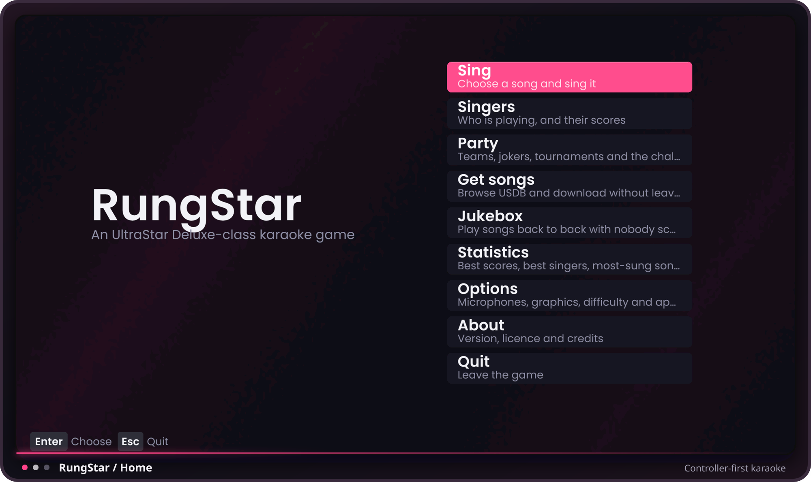
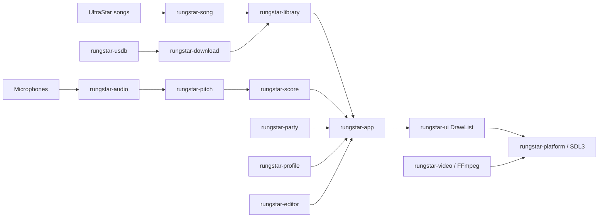

<p align="center">
  
</p>

<h1 align="center">RungStar</h1>

<p align="center">
  <strong>A controller-first karaoke game built for the living room.</strong><br>
  Sing, score, browse, edit, and manage an UltraStar library without leaving the game.
</p>

<p align="center">
  <a href="https://github.com/walkim14/RungStar/actions/workflows/ci.yml"></a>
  
  
  <a href="LICENSE"></a>
</p>

<p align="center">
  <a href="docs/images/rungstar-home.svg">
    
  </a>
</p>

> [!IMPORTANT]
> RungStar is a playable, actively developed **pre-1.0 project**. The complete path from song
> browser to live scoring and results is implemented, but interfaces and saved-data formats may
> still change before the first stable release.

## What is RungStar?

RungStar is a native Rust karaoke game in the
[UltraStar Deluxe](https://github.com/UltraStar-Deluxe/USDX) tradition. It combines a
six-player singing game, a fast local song library, party modes, profiles, statistics, a song
editor, and optional USDB browsing in one gamepad-friendly interface.

The project is designed for Windows PCs and SteamOS handhelds attached to a television. Its UI
uses a resolution-independent design space, every core workflow works with a controller, and
performance-sensitive systems are measured against a six-singer Steam Deck workload.

| At a glance | |
|---|---|
| **Players** | 1-6 simultaneous singers, including duet tracks |
| **Input** | Keyboard, mouse, controllers, and multiple microphone devices |
| **Songs** | UltraStar `.txt`, `.upl` playlists, local media, and USDB metadata conventions |
| **Platforms** | Windows 10/11, Linux, and SteamOS/Steam Deck |
| **Rendering** | SDL3 renderer with GPU-generated ambient and glow effects |
| **License** | GPL-3.0-or-later |

## Highlights

| | |
|---|---|
| **Sing together** | Score up to six singers across multiple capture devices, with stereo-channel splitting for dual-microphone interfaces. |
| **Find anything** | Search artist, title, metadata, and full lyrics through a persistent SQLite FTS5 index. Typo-tolerant fallback finds songs even when the spelling is not exact. |
| **Built for controllers** | Browse, configure, sing, play party modes, inspect statistics, and edit songs without reaching for a keyboard. |
| **See what scored** | Octave-agnostic matching, live pitch feedback, dimensional note bubbles, sweeping playheads, lyric effects, and per-singer colors keep the display aligned with the scoring engine. |
| **Keep the library local** | Incremental scans only reopen changed files. Play counts, loudness measurements, profiles, and highscores remain local and survive rescans. |
| **Run on the Deck** | Responsive layouts, bounded pitch-analysis cost, runtime codec checks, controller glyphs, and a dedicated 1280x800-equivalent layout test target SteamOS directly. |

## Singing And Scoring

- Up to **six simultaneous singers** with independent pitch detection and score panels.
- Solo and duet tracks, with layouts derived from the active singer count rather than fixed
  screen templates.
- Octave-independent pitch matching that folds a detected note into the target octave before
  comparing it.
- A 10,000-point scoring model covering normal, golden, rap, and freestyle notes plus line
  bonuses.
- Five lyric effects, live pitch trails, note glows, beat-reactive stage lighting, video
  playback, pause flow, and detailed results.
- Microphone diagnostics that separate silence, low level, unstable pitch, and a wrong note.
- Built-in latency calibration using repeated swept-sine correlation instead of asking players
  to guess a delay value.
- EBU R128 loudness analysis with headroom-aware normalization, cached after the first decode so
  browsing never pays the cost twice.

The scoring clock and drawing clock are deliberately separate. Detection accounts for capture
delay while the visual playhead stays tied to audible playback, so calibration improves scoring
without making the staff feel late.

## Song Library

RungStar treats a large library as a database, not as a directory it must parse from scratch on
every launch.

- Incremental scanning keyed by file size and modification time.
- SQLite storage with an FTS5 index over artist, title, genre, language, edition, creator, and
  the complete lyric text.
- Prefix search, diacritic folding, phrase promotion, and bounded Levenshtein fallback after an
  exact search misses.
- Filters for genre, language, decade, edition, folder, and creator.
- List, chessboard, and roulette browser layouts backed by one cursor and selection model.
- Cover art, audio previews, context actions, favorites/playlists, play history, and loudness
  metadata.
- Background scanning through SQLite WAL mode, keeping the browser responsive while the index is
  updated.

Reference measurements from the development machine in release mode:

| Workload | Measured result |
|---|---:|
| Warm rescan of 30,000 songs | 1.2 s |
| Prefix search | 3.3 ms |
| Two-word search | 8.1 ms |
| Full-lyric search | 44 ms |
| Typo fallback after a miss | 78 ms |
| Browse by artist | 6.2 ms |

These numbers are benchmarks, not minimum-system guarantees. Run the scale example on your own
machine with:

```console
cargo run --release --example scale -p rungstar-library
```

## More Than Quick Play

### Profiles And Statistics

Create local player profiles, choose singers before a song, save per-song highscores, inspect
four statistics views, and import an existing UltraStar `Ultrastar.db`. Scores are attached to
the selected singers at session start, so multiplayer results do not disappear into anonymous
player slots.

### Party And Tournament Modes

The party engine models UltraStar's challenge modes as composable rules rather than scripts.
Fourteen challenges can hide information, stop a round early, or knock singers out. Party play,
tournaments, medleys, and jukebox sessions all reuse the same tested singing session.

### Song Editor

The in-game piano-roll editor places a peak waveform behind the notes and supports note timing,
pitch, lyrics, line breaks, gap changes, and tempo correction. Operations enforce minimum note
length and non-overlap rules. Snapshot-based undo keeps every edit reversible without relying on
a separate inverse implementation for each command.

### USDB And Downloads

The optional browser can search USDB and stage resources in a temporary directory. A song only
moves into the library after its required files are complete, while missing optional artwork or
video does not discard playable audio. Downloads use rate limiting, jittered retries, content
hashes, and repair metadata; passwords use the operating-system keyring where one is available.

RungStar does not grant rights to songs, lyrics, recordings, artwork, or videos. Only download,
import, or perform media you are legally allowed to use, and observe the terms of each source
service. No commercial song catalog is included with this repository.

## Interface And Performance

The UI crate contains no graphics API. Screens turn state into a `DrawList` of rectangles,
images, bubbles, and text; the platform crate renders that list through SDL3. This keeps layout
and interaction tests deterministic without requiring a window or GPU.

- The design space is always 1,000 units tall and expands horizontally with the display aspect
  ratio. Wider displays gain room instead of stretching a 4:3 layout.
- Themes control color, typography, spacing, and radius while screens continue to own layout.
- Poppins is bundled for the primary interface, with Fira Sans and system coverage fallbacks.
- WGSL compute shaders generate compact ambient and glow textures at startup. The live frame
  remains a small set of ordinary textured draws instead of running expensive full-screen
  effects continuously.
- CAMDF pitch detection measures about 12.9 microseconds per analysis on the development
  machine. Six singers at 100 detections per second use less than one percent of one measured
  CPU core for detection.
- Layout tests draw every screen at Steam Deck dimensions and reject out-of-bounds commands,
  overlapping text, and text below the minimum physical size.

## Architecture



| Crate | Responsibility |
|---|---|
| [`rungstar-app`](crates/rungstar-app) | Main game, diagnostics, standalone sing tool, and hardware/session ownership |
| [`rungstar-ui`](crates/rungstar-ui) | Pure screen state, responsive layout, themes, input behavior, and draw commands |
| [`rungstar-platform`](crates/rungstar-platform) | SDL3 window, renderer, fonts, controller mapping, interface audio, and GPU effects |
| [`rungstar-song`](crates/rungstar-song) | Lenient UltraStar parser/writer, beat math, metadata, and repair passes |
| [`rungstar-library`](crates/rungstar-library) | Incremental scanning, SQLite/FTS5 search, filters, previews, and playlists |
| [`rungstar-audio`](crates/rungstar-audio) | Decode, playback clock, capture routing, calibration, and loudness analysis |
| [`rungstar-pitch`](crates/rungstar-pitch) | CAMDF and MPM pitch detectors |
| [`rungstar-score`](crates/rungstar-score) | Note matching, line bonuses, feedback runs, and final scores |
| [`rungstar-video`](crates/rungstar-video) | FFmpeg-backed song-video decoding and bounded frame scaling |
| [`rungstar-editor`](crates/rungstar-editor) | Editor document, operations, waveform, validation, and undo history |
| [`rungstar-profile`](crates/rungstar-profile) | Profiles, highscores, statistics, and UltraStar database import |
| [`rungstar-party`](crates/rungstar-party) | Party challenges, tournaments, medleys, and jukebox rules |
| [`rungstar-usdb`](crates/rungstar-usdb) / [`rungstar-download`](crates/rungstar-download) | USDB protocol plus atomic, repairable media acquisition |

## Compatibility

RungStar reads and writes the UltraStar `.txt` format, reads `.upl` playlists, understands
USDB's `#VIDEO` metadata convention, and imports existing `Ultrastar.db` highscores. Parsing is
intentionally lenient: malformed notes and unknown lines produce warnings where possible instead
of making an otherwise playable real-world song disappear.

Parser and repair behavior is checked byte-for-byte against the usdb_syncer fixture corpus.
Property tests also verify that normalization reaches a fixed point and that songs survive
parse/write round trips.

## Getting Started

Tagged installers are produced by the release workflow. For development, build the game from
source.

### Prerequisites

- Git and the Rust toolchain from [rustup](https://rustup.rs/). The workspace requires Rust
  1.85 or newer.
- **Windows:** LLVM/libclang for `ffmpeg-sys` binding generation. SDL3 and the required FFmpeg
  libraries are vendored in the repository.
- **Linux:** a C/C++ build toolchain plus SDL3, ALSA, udev, FFmpeg development libraries,
  `pkg-config`, and CMake. The exact CI package list is in
  [`.github/workflows/ci.yml`](.github/workflows/ci.yml).
- A microphone for singing. The browser, editor, self-check, and automated test suite work
  without one.

### Build And Launch

```console
git clone https://github.com/walkim14/RungStar.git
cd RungStar
cargo run --release -p rungstar-app --bin rungstar
```

On first launch, choose the folder that contains your UltraStar songs. The index is created next
to the application's local data rather than inside the song library.

Useful entry points:

```console
# Start the complete game
cargo run --release -p rungstar-app --bin rungstar

# Start, initialize every production subsystem, draw every screen, and exit
cargo run --release -p rungstar-app --bin rungstar -- --check

# Inspect microphones, pitch detection, and controller input
cargo run -p rungstar-app --bin rungstar-diagnostics

# Measure end-to-end speaker and microphone latency
cargo run --release -p rungstar-app --bin rungstar -- --calibrate

# Open one song directly, outside the library browser
cargo run -p rungstar-app --bin rungstar-sing -- "path/to/song.txt"
```

Pass `--mic "part of device name"` to calibration or `rungstar-sing` when automatic microphone
selection does not choose the intended device.

## Adding Songs

A conventional library keeps one song per directory:

```text
Songs/
  Artist - Title/
    song.txt
    song.ogg
    cover.jpg
    video.webm
```

The exact filenames come from headers such as `#MP3`, `#COVER`, `#BACKGROUND`, and `#VIDEO` in
the song file. Audio and video support is based on the codecs available in the packaged FFmpeg
build; Ogg Vorbis, MP3, AAC, AV1, and H.264 are covered by the validated distributions.

## Packaging

Release packaging is kept in the repository and runs the same executable self-check used during
development.

| Target | Output | Command |
|---|---|---|
| Windows | Portable directory and zip | `pwsh packaging/windows/portable.ps1` |
| Windows | Inno Setup installer | `iscc packaging/windows/rungstar.iss` |
| SteamOS / Linux | Flatpak bundle | `bash packaging/linux/build-flatpak.sh` |
| Linux | AppImage | `bash packaging/linux/appimage.sh` |

See [packaging/README.md](packaging/README.md) for native dependencies, sandbox permissions,
bundled tools, Steam Deck installation, and release-layout details.

Settings, profiles, statistics, and songs are never stored inside the installation directory.
Replacing or uninstalling a package therefore cannot silently remove a player's library or
highscores.

## Testing

The default quality gate covers formatting, all workspace targets, strict Clippy warnings, and
documentation tests on Windows and Linux.

```console
cargo fmt --all --check
cargo clippy --workspace --all-targets -- -D warnings
cargo test --workspace --all-targets
cargo test --workspace --doc
```

Focused checks:

```console
# Deep generated-song parser and normalization run
PROPTEST_CASES=5000 cargo test -p rungstar-song

# Pitch detector benchmarks
cargo bench -p rungstar-pitch

# Scan and search a real library without starting the game
cargo run --release --example index -p rungstar-library -- "path/to/Songs"

# Verify audio and video files against packaged decoders
cargo run --release --example decode_check -p rungstar-audio -- "path/to/Songs"
cargo run --release --example playback_check -p rungstar-video -- "path/to/Songs"
```

Tests cover parser fixtures, score invariants, audio clocks, database migrations, FTS
synchronization, party rules, editor undo, download recovery, screen commands, responsive
layout, Steam Deck bounds, interface sounds, and font fallback behavior.

## Repository Guide

```text
RungStar/
|-- assets/       fonts, sounds, themes, and WGSL shaders
|-- crates/       focused Rust libraries plus the game executables
|-- packaging/    Windows, AppImage, Flatpak, and Steam launch assets
|-- tools/        deterministic asset-generation utilities
|-- vendor/       pinned Windows SDL3 and FFmpeg runtime files
|-- CLAUDE.md     architecture decisions, measurements, and implementation notes
`-- NOTICE.md     licensing rationale and third-party attribution
```

The detailed engineering record in [CLAUDE.md](CLAUDE.md) explains decisions that are easy to
get subtly wrong, including beat timing, octave folding, line bonuses, clock synchronization,
incremental FTS updates, loudness normalization, and Steam Deck packaging.

## Contributing

Issues and focused pull requests are welcome. Before opening a pull request:

1. Keep behavior compatible with real, imperfect UltraStar libraries. A malformed line should
   normally become a warning, not make the complete file unusable.
2. Add a regression test for behavior changes, especially in parsing, scoring, timing, download
   recovery, or screen layout.
3. Run formatting, strict Clippy, and the workspace test suite shown above.
4. Keep the UI crate independent of SDL, wgpu, audio, and filesystem APIs so screens remain
   deterministic and testable.

## License And Attribution

RungStar is distributed under the **GNU General Public License v3.0 or later**. See
[LICENSE](LICENSE) for the license text and [NOTICE.md](NOTICE.md) for attribution and the
clean-room compatibility rationale.

Behavior is reimplemented from written specifications and observed formats; upstream source is
not copied into this repository. UltraStar Deluxe and usdb_syncer remain separate projects with
their own maintainers and release processes.
